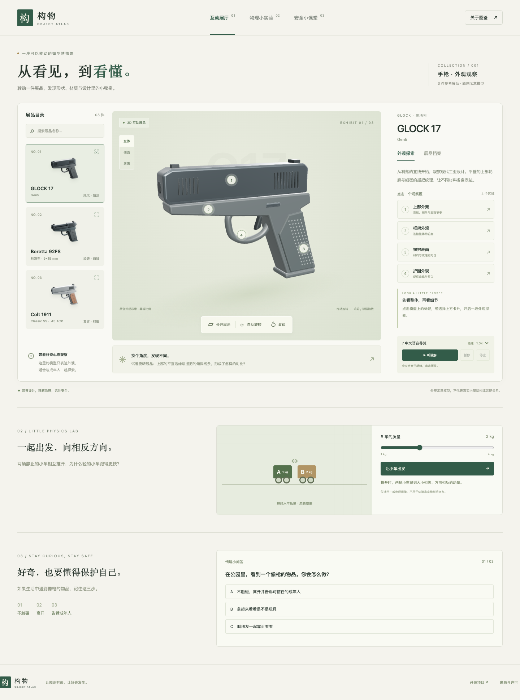

# 构物 · 手枪图鉴

一座可以转动的微型博物馆：从外观、材质与基础物理出发，观察三款参考展品。

**[打开互动展厅](https://baroncyrus.github.io/object-atlas/)** · [源码](https://github.com/BaronCyrus/object-atlas)



## 内容

- 三款可辨识的原创 Blender 外观示意：GLOCK 17 Gen5、Beretta 92FS、Colt 1911 Classic SS。
- 真正的 GLB 加载、拖动旋转、缩放、视角预设、自动旋转与复位。
- 点选模型表面或编号标记，联动四个外观观察区、高亮和中文讲解；区域可分开展示。
- 系统中文语音导览：播放、暂停、继续、停止与语速。无支持或无中文声音时保留文字和明确状态。
- 指定版本的资料卡、官方来源、小车动量实验与三个安全情境。
- 响应式桌面 / 平板 / 手机布局，键盘操作、对话框焦点管理、加载错误重试。

模型是原创、非等比例的外观示意，没有真实内部机构、制造尺寸或装配过程。分开展示只是四个观察区域的视觉展开。Colt 展品对应当代 Classic SS .45 ACP 配置，不把整个 1911 系列概括为同一规格。

## 本地开发

Node.js 24，依赖由 `package-lock.json` 锁定。

```sh
npm ci
npm run dev
npm run build
npm run preview
```

Three.js 0.186.0、Vite 8.3.0。脚本、样式、模型与缩略图在同一站点加载；字体使用系统字体，不依赖 CDN。

## 验证

```sh
# macOS 默认使用已安装的 Google Chrome；也可指定 CHROME_PATH。
npm test
# Linux / CI 安装 Playwright Chromium 后使用其默认路径。
npx playwright install --with-deps chromium
CI=1 npm test
# 在已经部署的正式站点上运行同一套交互验收
SITE_URL=https://baroncyrus.github.io/object-atlas/ npm test
```

验收覆盖模型加载、不同展品隔离、表面射线点选、高亮、区域展开和复位、鼠标与键盘镜头操作、检索与空结果、资料卡、语音状态、实验、问答、失败重试、快速切换、390 / 768 像素布局。测试中的语音状态用可控替身验证；实际能否发声依赖设备。详细记录见 [验收报告](reports/validation.md)。

## Blender 资产

- `models/*.blend`：三个独立、可编辑的源场景，含展示灯光和相机。
- `public/models/*.glb`：网页使用的 glTF 2.0 二进制模型，每个文件只有对应展品。
- `public/images/*.png`：Blender Cycles 渲染的透明底配图。
- `scripts/generate_models.py`：可复现的原创建模脚本，几何、材料和表面纹理均由项目生成。

在 Blender 5.2 中生成：

```sh
blender --background --factory-startup --python scripts/generate_models.py
# 分别渲染三个场景，例如：
blender --background models/g17.blend --python scripts/render_preview.py -- g17
```

生成器只新建 `Atlas_` 场景，保留已有场景和文件。推荐使用上面的独立后台进程，以免影响正在编辑的文件。重复运行交互式版本会创建新的 Atlas 场景，建议在新的 Blender 会话生成。每个 GLB 顶层有 `upper`、`frame`、`grip`、`guard` 四组，网格通过 `extras.region` 标注观察区。Blender 场景单位是任意展示单位，不提供真实尺度。

本次先通过 Blender MCP 读取现有场景并执行建模；GUI 实例在文件导出阶段无响应，后续生成、导出与配图渲染由本机 Blender 5.2.1 独立后台进程完成。未覆盖用户原有工程。没有使用收费生成服务或第三方下载模型。

## 资料来源

核对日期：2026-09-11。只提取与识别展品相关的少量事实，讲解为项目原创。

| 展品 / 指定版本 | 口径标识 | 标准弹匣容量 | 官方来源 |
| --- | --- | --- | --- |
| GLOCK 17 Gen5 | 9 mm Luger | 17 | [GLOCK G17 Gen5](https://br.glock.com/pt-br/pistolas/g17-gen5) |
| Beretta 92FS，9×19 mm 标准型 | 9×19 mm | 15 | [Beretta Defense 92FS](https://www.berettadefense.com/products/92fs-bdt/) |
| Colt 1911 Classic SS，.45 ACP | .45 ACP | 7 | [Colt Classic SS](https://www.colt.com/detail-page/1911-classic-ss/) |

容量不含膛内数量，不同版本与地区配置可能不同。Colt 页面有多种变体，本项目采用 .45 ACP 版本的官方图示规格。未给出缺少统一依据的后坐力排名。小车实验采用理想水平无摩擦模型，初始总动量为零，给两车大小相同、方向相反的冲量；展示速度与质量成反比，不拟合真实枪械。

## GitHub Pages

`main` 分支推送触发 `.github/workflows/pages.yml`：安装固定依赖 → 浏览器验收 → Vite 构建 → Pages 部署。GitHub 仓库的 Pages 构建来源应设置为 **GitHub Actions**。`base: './'` 兼容仓库子路径。站点无需后端或 API 密钥。

## 授权与限制

项目代码、原创模型和配图均以 [MIT](LICENSE) 开源。型号和商标属于各自权利人，仅用于识别参考展品，与制造商无隶属或背书关系。Three.js 等第三方依赖保留各自的许可证。

本站没有统计脚本，不收集账户信息。语音由系统 Web Speech API 提供，部分声音可能使用系统厂商的在线服务。未录制或附带真人音频。无 WebGL 时仍可查看模型配图、资料、讲解和学习内容。自动验收使用 Chromium；未做所有真实手机与浏览器的穷尽兼容测试。
