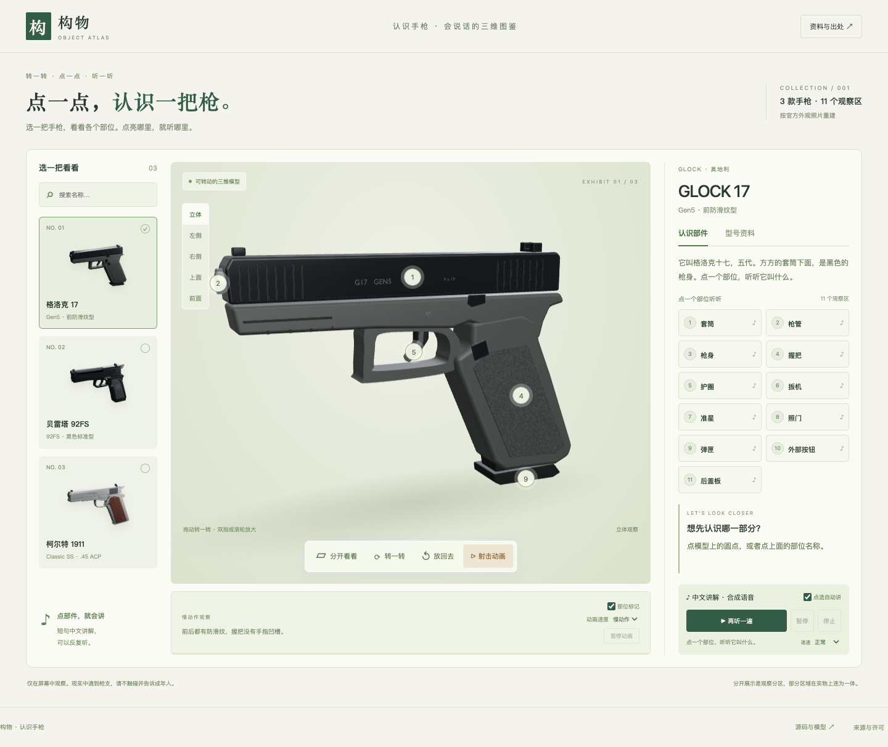

# 构物 · 认识手枪

**[打开会说话的三维图鉴](https://baroncyrus.github.io/object-atlas/)**

转动模型，点部件听讲解，观看可以暂停的慢动作射击示意。



## 这一版

- 按对应版本的官方外观照片重做 **GLOCK 17 Gen5、Beretta 92FS、Colt 1911 Classic SS**，三个模型分别建形。
- 每款 **11 个可点选观察区**：套筒、枪管外形、枪身、握把、护圈、扳机外形、准星、照门、弹匣外形、外部按钮与后部部件。GLOCK 后部为后盖板，另两款为击锤外形。
- **37 段随网页加载的中文合成语音**。点击部位默认播放，可以暂停、继续、停止、变速或关闭自动讲解；不依赖设备的中文系统语音包。
- 立体旋转与真正的正交左侧、右侧、顶部、前面视图。
- 分区展开和复位；弹头前移、枪身后坐、套筒短暂后移的慢动画，可暂停和重播。
- 移除旧版物理小车实验和情境问答。页面集中在识别枪支外形与部位。
- 手机版大按钮、键盘操作、失败重试；静止画面和屏幕外模型停止重绘。

## 参考资料的边界

[完整参考记录](reports/references-v2.md)列出来源、照片角度、版本和版权情况。

- GLOCK 找到官方 360° 摄影的侧面、前面和顶部等照片；它们不是工程三视图。
- Beretta 找到官方多角度图库；Colt 找到对应 Classic SS 的清晰侧面图。后两款没有找到可靠完整三视图，未核实角度采用艺术化近似。
- 百科入口包括 Royal Armouries、Smithsonian 馆藏和 Modern Firearms。建模以匹配版本的制造商外观照片为主。
- Colt 官网当前变体描述和容量字段冲突，因此资料卡暂不标注容量。G17 和 92FS 的标准配置数字链接到相应官方来源，不能推及所有版本。

模型是**非功能性数字展品**，只表达外观和主要部位。没有工作内部机构、枪膛、膛线、内部配合、精密尺寸或制造公差。部分握把、护圈和枪身在实物上连为一体；分开展示是观察分区，不是拆装教学。枪管内部延伸部分和弹匣体采用简化的封闭外形。动画速度、运动幅度和弹头形状为观察而简化，不对应真实弹道数据，也没有装填、瞄准或射击操作流程。

## 运行与测试

Node.js 24，Three.js 0.186.0、Vite 8.3.0，依赖锁定在 `package-lock.json`。

```sh
npm ci
npm run dev
npm test
npm run build
npm run preview
```

macOS 测试默认使用已安装的 Google Chrome，可通过 `CHROME_PATH` 指定位置。Linux / CI：

```sh
npx playwright install --with-deps chromium
CI=1 npm test
```

正式站点复验与资源哈希核对：

```sh
SITE_URL=https://baroncyrus.github.io/object-atlas/ npm test
node scripts/verify-site.mjs
```

浏览器验收涵盖三款 GLB、11 个区、高亮和射线点选、展开复位、正交视图、旋转缩放、动画移动/暂停/中断、真实音频播放进度、音频错误重试、关闭自动讲解、移除旧内容、资料冲突和 390/768 像素布局。语音验收检查解码与播放状态，未声称完成逐句人工听审。详情见[新版验收记录](reports/validation-v2.md)。

## 模型和语音源文件

- `models/*.blend`：独立源场景，保留分部网格、原创表面贴图、灯光与相机。
- `public/models/*.glb`：网页模型；运行时按部位和材质合并绘制网格，保留独立高亮。
- `public/images/*.png`：Blender Cycles 渲染配图。
- `public/textures/`：代码生成的聚合物、木材、金属和粗糙度/法线表面图。
- `public/audio/`：37 段 MP3 和原始讲解清单。

模型重建：

```sh
python scripts/create_surface_textures.py  # 需要 numpy、Pillow
blender --background --factory-startup --python scripts/generate_models.py
blender --background models/g17.blend --python scripts/render_preview.py -- g17
```

生成器新建 `Atlas_v2_` 场景，使用任意艺术单位；不覆盖其他工程。推荐独立后台 Blender 5.2.1。

中文音频生成需 Python 3.11、`kokoro`、`misaki[zh]`、`torch`、`soundfile`、`numpy` 和 FFmpeg。运行 `scripts/generate_audio.py` 使用 Apache-2.0 的 Kokoro 中文模型与 `zf_001` 通用声线。仅开发过程生成，浏览器只加载 MP3，不下载神经网络模型。参考摄影、模型权重和 Python 环境不提交。

## 开源与部署

代码、原创模型、纹理、渲染和原创讲解采用 [MIT](LICENSE)。语音及第三方库来源见 [THIRD_PARTY_NOTICES.md](THIRD_PARTY_NOTICES.md)。官方摄影不在站点中再分发，商标用于识别，无制造商背书。

`main` 推送触发 GitHub Actions 的测试、构建和 Pages 部署。所有运行资源同源加载，无后端、分析脚本或账户采集。文件更新通过版本参数刷新模型、配图与音频缓存。

自动检查使用 Chromium 和模拟设备尺寸，不代表所有真实手机已实测。
